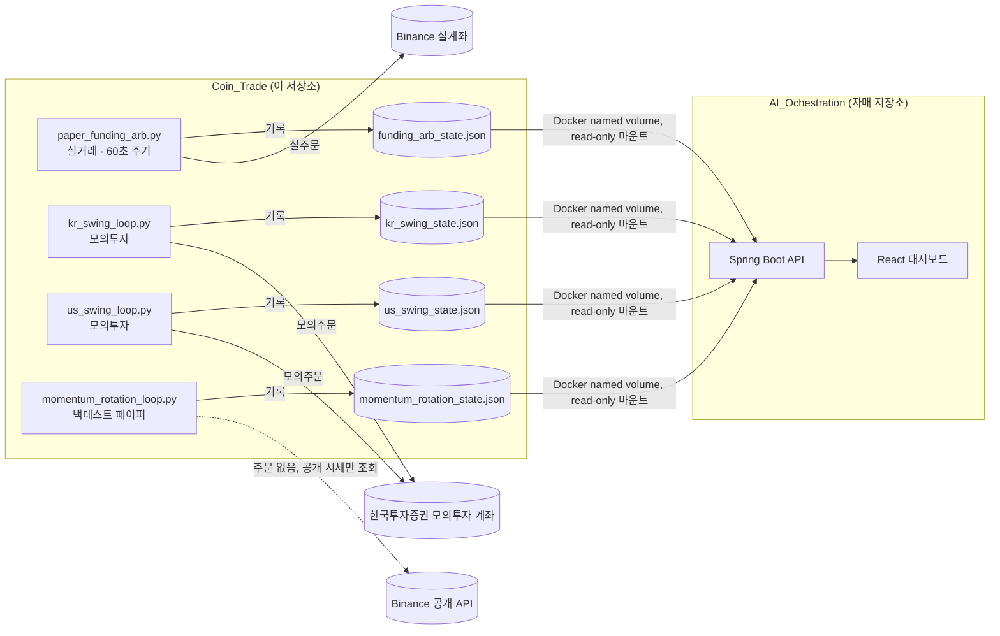

<div align="center">

# 🪙 Coin_Trade

**개인용 퀀트 자동매매 엔진 — 크립토 실거래 & KR/US 주식 모의투자 & 전략 리서치**


</div>

---

## 목차

1. [이 저장소는 무엇인가](#이-저장소는-무엇인가)
2. [실행 중인 전략 4종](#실행-중인-전략-4종)
3. [아키텍처](#아키텍처)
4. [디렉터리 구조](#디렉터리-구조)
5. [빠르게 시작하기](#빠르게-시작하기)
6. [환경 변수](#환경-변수)
7. [리서치 스크립트 (probe / backtest)](#리서치-스크립트-probe--backtest)
8. [자매 저장소: AI_Ochestration](#자매-저장소-ai_ochestration)
9. [안전 수칙 & 주의사항](#안전-수칙--주의사항)

---

## 이 저장소는 무엇인가

혼자 운영하는 **자동매매 봇 모음**입니다. 크립토 선물 펀딩비 차익거래(실거래, 실제 자금 투입)와 한국/미국 주식 스윙 매매(모의투자), 그리고 검증 중인 코인 선물 롱숏 전략(백테스트 페이퍼 모드)까지 총 4개의 독립된 자동매매 루프가 이 안에 들어 있습니다.

모든 봇은 Docker 컨테이너로 24시간 돌아가며, 자기 상태(포지션·손익·로그)를 JSON 파일에 기록합니다. 이 JSON은 [`AI_Ochestration`](#자매-저장소-ai_ochestration) 저장소의 백엔드가 읽어서 웹 대시보드로 보여줍니다 — 즉 이 저장소 혼자서는 매매만 하고, "눈으로 보는" 대시보드는 자매 저장소가 담당하는 구조입니다.

## 실행 중인 전략 4종

| 전략 | 모드 | 시장 | 핵심 로직 | 진입점 |
|---|---|---|---|---|
| 🔴 **펀딩비 차익거래** | **실거래(실제 자금)** | 바이낸스 USDⓈ-M 선물 + 스팟 | 현물 롱 + 무기한선물 숏으로 델타중립 구성, 8시간마다 정산되는 펀딩비 수취 | `app/paper_funding_arb.py` |
| 🔵 **국내주식 스윙** | 모의투자(KIS) | 코스피/코스닥 64종목 워치리스트 | EMA9/21 골든크로스 진입 + SMA200 필터 + 장중 -2% 손절 | `app/kr_swing_loop.py` |
| 🟢 **미국주식 스윙** | 모의투자(KIS 해외) | NASDAQ/NYSE 55종목 워치리스트 | 국내와 동일 전략, 미국 동부시간 기준 이중주기 | `app/us_swing_loop.py` |
| 🟡 **모멘텀 로테이션** | 백테스트(페이퍼, 무실주문) | 바이낸스 USDⓈ-M 선물 47종목 | 14일 모멘텀 상위 8개 롱 / 하위 8개 숏, 3일마다 리밸런스, 달러중립 | `app/momentum_rotation_loop.py` |

> ⚠️ **실거래는 펀딩비 차익거래 하나뿐입니다.** 나머지 세 전략은 실제 주문이 절대 나가지 않는 모의투자/백테스트 모드입니다. 자세한 내용은 [안전 수칙](#안전-수칙--주의사항)을 참고하세요.

### 왜 이 전략들인가

- **펀딩비 차익거래**: 방향성 베팅 없이(현물 롱 = 선물 숏으로 가격 변동 상쇄) 펀딩비만 수취하는 델타중립 캐리 전략. 잡코인은 급락 리스크가 커서 제외하고, 유동성 높은 ETH/XRP/DOGE 3종 고정으로 운영합니다(코인 로테이션은 백테스트 결과 고정 3종보다 성과가 낮아 기각).
- **KR/US 스윙**: 추세추종(EMA 골든크로스) 단순 전략. 대형주~중견주까지 워치리스트를 넓혀 백테스트로 검증된 종목만 채택했습니다.
- **모멘텀 로테이션**: 단일 종목 추세추종(EMA/MACD/Donchian 등)으로는 연 10% 수익률 목표를 넘기지 못해, 완전히 다른 전략군인 **횡단면 상대모멘텀**(상위권 롱, 하위권 숏)으로 전환해 찾아낸 결과물입니다. 파라미터 스윕(36가지 조합)으로 로버스트함을 확인했고(연환산 29.16%, MDD 18.6%), 아직 실거래 검증 전이라 페이퍼 모드로만 운영합니다.

## 아키텍처



## 디렉터리 구조

```
trading/
├── Dockerfile                     # 모든 봇이 공유하는 단일 이미지 (python:3.12-slim)
├── requirements.txt               # ccxt, pandas-ta, backtesting, requests
├── app/
│   ├── (실거래) paper_funding_arb.py, paper_exchange.py, paper_state.py, paper_trade_loop.py
│   ├── (국장)   kr_daily_scan.py, kr_intraday_risk.py, kr_swing_loop.py, kr_state.py,
│   │            kr_watchlist.py, ema_cross_watchlist.py
│   ├── (미장)   us_daily_scan.py, us_intraday_risk.py, us_swing_loop.py, us_state.py,
│   │            us_watchlist.py, us_swing_search.py
│   ├── (모멘텀) momentum_rotation_loop.py, momentum_state.py, momentum_strategy.py
│   ├── (KIS 연동) kis_auth.py, kis_data.py, kis_overseas_data.py, kis_order.py,
│   │              kis_overseas_order.py, kis_fetch_base.py
│   ├── (공통 유틸) data.py, futures_data.py, indicators.py, more_indicators.py,
│   │               extra_indicators.py, swing_indicators.py, markets.py, regime.py
│   ├── (전략 정의) strategies.py, strategy.py, futures_strategies.py,
│   │               swing_strategies.py, broad_strategies.py, extra_strategies.py,
│   │               pairs_strategies.py
│   └── (리서치/백테스트 스크립트) backtest.py, futures_backtest.py, pairs_backtest.py,
│       funding_arb_backtest.py, funding_arb_rotation_backtest.py, compare.py,
│       full_search.py, probe_runner.py, crypto_trend_probe.py, kr_top200_probe.py,
│       us_top500_probe.py, futures_*_probe.py, param_grids.py, registry.py, validation.py 등
└── docs/
    └── toss_live_migration_plan.md   # 국내/미국 스윙봇을 토스 실거래 계좌로 옮길 때의 계획 메모
```

## 빠르게 시작하기

이 저장소 단독으로는 봇 로직을 실행/테스트만 할 수 있고, 실제 24시간 구동 + 웹 대시보드는 [`AI_Ochestration`](#자매-저장소-ai_ochestration)의 `docker-compose.yml`을 통해서 이뤄집니다.

### 1) 단독으로 특정 봇 하나만 테스트하고 싶을 때

```bash
cd trading
docker build -t coin-trade .

# 예: KR 워치리스트 전체 백테스트 스크리닝
docker run --rm --entrypoint python coin-trade -u -m app.kr_top200_probe

# 예: 모멘텀 로테이션 파라미터 스윕
docker run --rm --entrypoint python coin-trade -u -m app.futures_momentum_rotation_sweep
```

### 2) 실제 24시간 봇으로 돌리고 싶을 때 (AI_Ochestration과 함께)

```bash
git clone https://github.com/khsqowp/AI_Ochestration.git
cd AI_Ochestration
git clone https://github.com/khsqowp/Coin_Trade.git trading   # ← 이 저장소를 trading/ 폴더로 클론

cp .env.example .env   # 아래 환경 변수 채우기
docker compose --profile paper-trading --profile kr-swing --profile us-swing --profile momentum-rotation up -d --build
```

`docker-compose.yml`이 `build: ./trading`으로 이 저장소를 상대경로 참조하기 때문에, 반드시 `AI_Ochestration` 루트 안에 `trading/`이라는 이름으로 위치해야 합니다.

## 환경 변수

`AI_Ochestration`의 `.env` 파일에 아래 값을 채웁니다(둘 다 이 하나의 `.env`를 공유합니다).

| 변수 | 필수 | 설명 |
|---|---|---|
| `BINANCE_API_KEY` / `BINANCE_SECRET_KEY` | ✅ (펀딩차익 실거래) | 바이낸스 **실계좌** 키. 스팟+선물 공용, Trade 권한 필요. **실제 자금이 움직이므로 출금 권한은 절대 부여하지 마세요.** |
| `HANTOO_TEST_KEY` / `HANTOO_TEST_SECRET` | ✅ (국장/미장) | 한국투자증권 **모의투자** Open API 키 |
| `FUNDING_ARB_TOTAL_CAPITAL_USDT` | - | 펀딩차익 봇에 배분할 총 자본(기본값은 코드 내 상수) |
| `FUNDING_ARB_LEVERAGE` | - | 선물 숏 레버리지 |
| `FUNDING_ARB_BALANCE_FRACTION` | - | 총자본 중 실제 매매에 쓰는 비율(기본 0.95, 마진/체결 버퍼용) |
| `PAPER_TRADE_CHECK_INTERVAL_SECONDS` | - | 펀딩차익 봇 폴링 주기(초), 기본 60 |
| `MOMENTUM_ROTATION_START_CAPITAL_USDT` | - | 모멘텀 로테이션 가상 시작 자본, 기본 10,000 USDT |
| `MOMENTUM_ROTATION_CHECK_INTERVAL_SECONDS` | - | 모멘텀 로테이션 폴링 주기(초), 기본 1800 |
| `PAPER_STATE_PATH` / `KR_SWING_STATE_PATH` / `US_SWING_STATE_PATH` / `MOMENTUM_ROTATION_STATE_PATH` | - | 각 봇의 상태 JSON 경로(도커 볼륨 기본 경로로 이미 설정됨, 보통 안 건드림) |

> `BINANCE_API_KEY`/`BINANCE_SECRET_KEY`는 **실계좌**이고, `HANTOO_TEST_KEY`는 이름 그대로 **모의투자 전용**입니다. 실수로 바꿔 넣지 않도록 주의하세요.

## 리서치 스크립트 (probe / backtest)

`app/` 안의 `*_probe.py`, `*_backtest.py`, `compare.py`, `full_search.py` 등은 **라이브 루프가 아닌 일회성 리서치 스크립트**입니다. 새 종목 후보를 스크리닝하거나, 새 전략의 연환산 수익률·MDD·Profit Factor를 검증할 때 직접 실행합니다.

```bash
docker run --rm --entrypoint python coin-trade -u -m app.futures_momentum_rotation_probe
```

이 저장소에 쌓인 리서치 흐름(참고용):

1. `funding_arb_rotation_backtest.py` — 코인 로테이션 vs 고정 3종 비교 → 고정이 항상 우세, 로테이션 기각
2. `crypto_trend_probe.py` — 스팟 추세추종 50종목 스크리닝 → SUI/XRP/TRX/NEAR/BNB 유효 엣지 발견(아직 미채택)
3. `futures_long_short_probe.py`, `futures_macd_full_universe.py`, `futures_donchian_probe.py` — 단일종목 선물 롱숏 전략들 → 전부 연 10% 미달
4. `futures_momentum_rotation_probe.py`, `futures_momentum_rotation_sweep.py` — 횡단면 모멘텀 로테이션 → **연 10% 목표 달성**, 파라미터 스윕으로 로버스트함 확인 → `momentum_rotation_loop.py`로 라이브(페이퍼) 전환

## 자매 저장소: AI_Ochestration

이 저장소는 **매매 로직만** 담당합니다. 대시보드 UI, 백엔드 API, 인증, 알림(n8n)은 [`AI_Ochestration`](https://github.com/khsqowp/AI_Ochestration)에 있습니다. 개발/운영은 두 저장소를 같은 서버의 한 디렉터리 트리 안에 두고(`AI_Ochestration/trading/` = 이 저장소), `AI_Ochestration`의 `docker-compose.yml` 하나로 전체를 기동하는 방식을 전제로 합니다.

## 안전 수칙 & 주의사항

- ⚠️ **이 코드는 투자 자문이 아니며, 개인 학습·실험 목적의 자동매매 봇입니다.** 실제 손실이 발생할 수 있습니다.
- 🔴 **펀딩비 차익거래(`paper_funding_arb.py`)만 실제 자금을 사용합니다.** 나머지는 전부 모의투자(KIS 가상계좌) 또는 완전 페이퍼(무실주문) 모드입니다.
- API 키에는 **출금(Withdraw) 권한을 절대 부여하지 마세요.** 매매(Trade)/조회(Read) 권한만 필요합니다.
- `.env`는 절대 커밋하지 않습니다(`.gitignore`에 이미 포함).
- 펀딩비 정산은 실제로 8시간마다(00:00/08:00/16:00 UTC)만 일어납니다 — 누적 손익을 재계산하는 로직을 건드릴 땐 이 점을 반드시 기억하세요(과거 이 지점에서 실제로 480배 과대계상 버그가 있었고, 거래소의 실제 정산 내역(`fetch_funding_history`)과 항상 대조 검증합니다).
